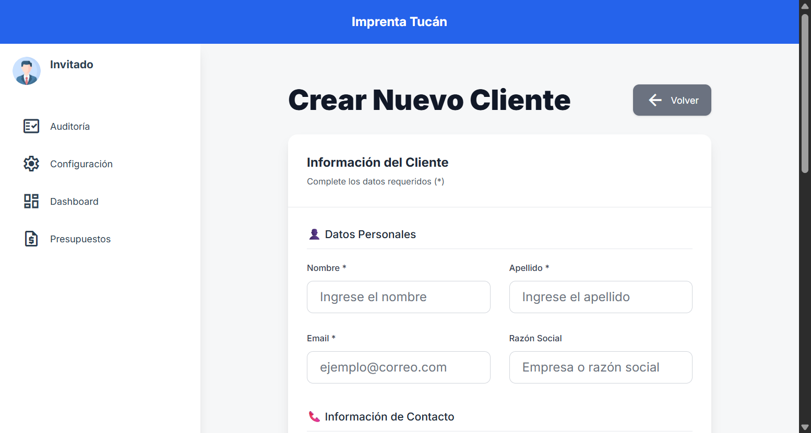
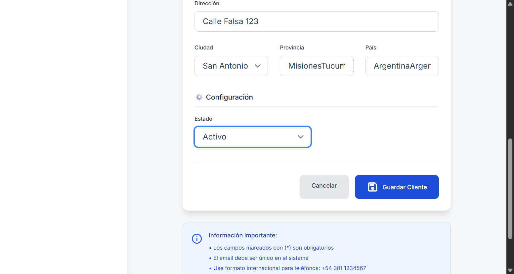
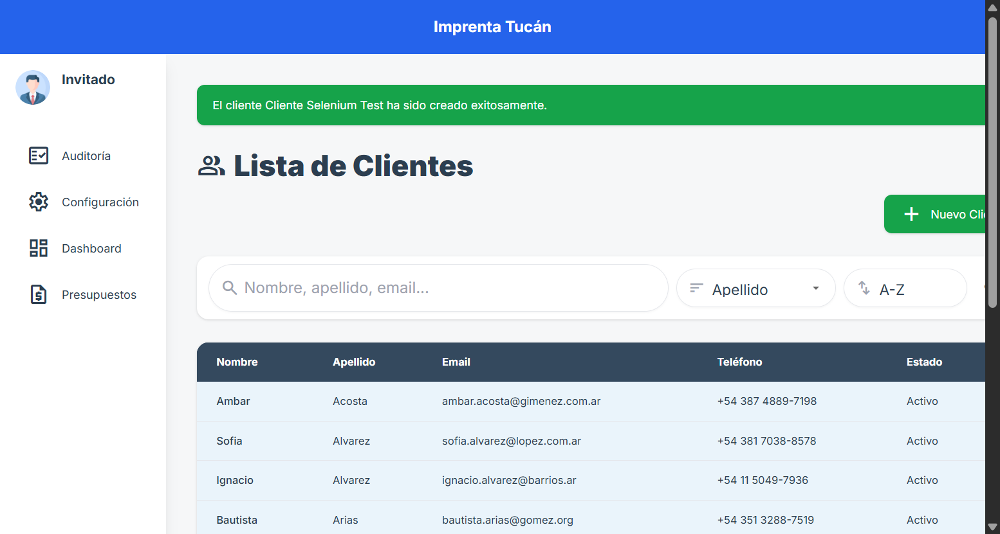
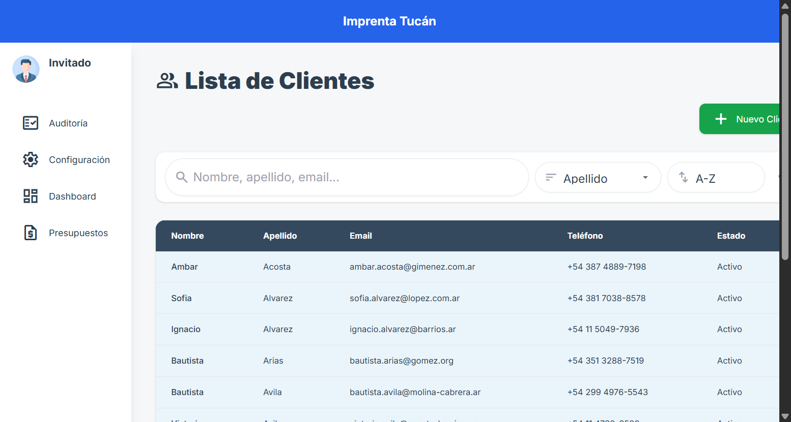
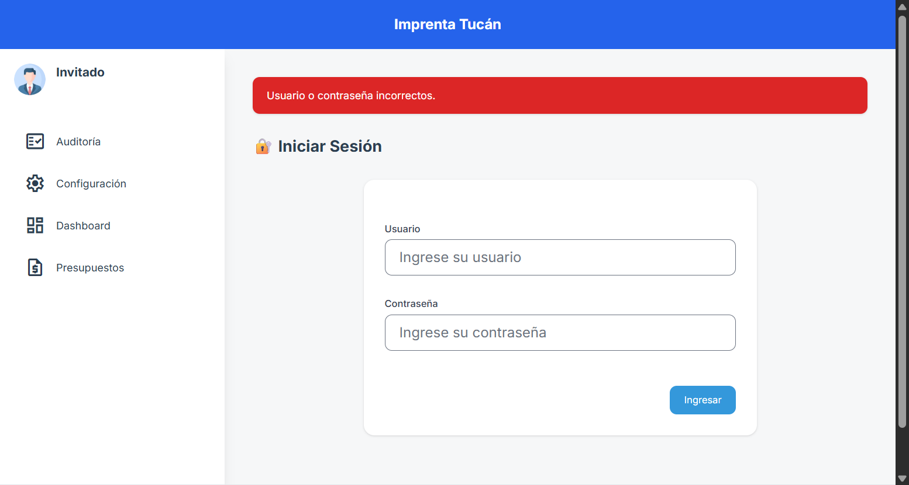
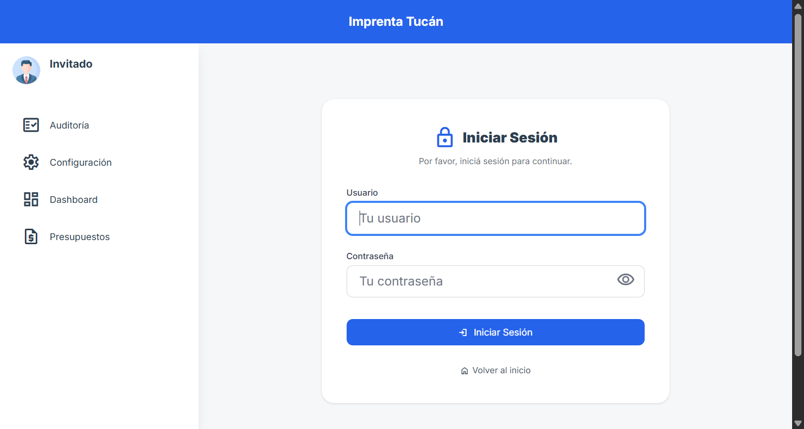

# Documentación de Pruebas de Software

## 1. Introducción
Este documento describe el plan, los casos y la estrategia de pruebas de software para el sistema de gestión de imprenta desarrollado en Django. El objetivo es asegurar la calidad, robustez y cumplimiento de los requisitos funcionales y no funcionales del sistema.

## 2. Alcance
Las pruebas cubren los módulos principales: gestión de insumos, productos, clientes, proveedores, pedidos y usuarios, así como la integración entre ellos y la interfaz web.

## 3. Estrategia de Pruebas
- **Tipo de pruebas:**
  - Pruebas unitarias
  - Pruebas de integración
  - Pruebas funcionales (end-to-end)
  - Pruebas de regresión
  - Pruebas de interfaz de usuario
- **Herramientas:**
  - Django TestCase
  - Pytest
  - Selenium (opcional para UI)

## 4. Plan de Pruebas
### 4.1. Preparación del entorno
- Base de datos de pruebas aislada
- Datos de prueba predefinidos (fixtures)
- Entorno virtual con dependencias controladas

### 4.2. Criterios de entrada y salida
- **Entrada:** Código migrado, entorno configurado, fixtures cargados
- **Salida:** Todos los casos críticos ejecutados y superados, sin errores bloqueantes

## 5. Casos de Prueba
### 5.1. Pruebas Unitarias
- **Insumo:**
  - Creación, edición y borrado de insumos
  - Cálculo de stock mínimo sugerido y cantidad a reponer
  - Validación de campos obligatorios y restricciones
- **Proveedor:**
  - Alta, baja y modificación
  - Relación con insumos
- **Pedido:**
  - Creación de pedidos y asignación de insumos
  - Actualización de stock tras pedido

### 5.2. Pruebas de Integración
- Flujo completo: alta de insumo → asignación a producto → generación de pedido → actualización de stock
- Integridad referencial entre modelos

### 5.3. Pruebas Funcionales
- Acceso a vistas protegidas según permisos
- Navegación y operaciones CRUD desde la interfaz
- Mensajes de error y éxito visibles al usuario

### 5.4. Pruebas de Regresión
- Ejecución automática tras cada cambio relevante
- Verificación de que funcionalidades previas no se rompen

## 6. Registro y Seguimiento
- Resultados de pruebas documentados en reportes (pytest, Django)
- Registro de bugs/incidencias en sistema de seguimiento (GitHub Issues, Jira, etc.)

## 7. Criterios de Aceptación
- 100% de pruebas unitarias críticas superadas
- 0 errores bloqueantes en pruebas de integración y funcionales
- Cobertura de código mínima del 80%

## 8. Anexos
- Ejemplo de comando de ejecución: `python manage.py test` o `pytest`
- Enlaces a scripts de prueba y fixtures

## 9. Ejemplos de Casos de Prueba

### 9.1. Prueba Unitaria: Creación de Insumo
- **ID:** INS-001
- **Objetivo:** Verificar que se puede crear un insumo con datos válidos.
- **Precondición:** Usuario autenticado con permisos de administración.
- **Entradas:**
  - nombre: "Papel obra 80g"
  - codigo: "PAP-80G"
  - proveedor: Proveedor válido
  - cantidad: 1000
  - precio_unitario: 2.50
- **Pasos:**
  1. Acceder al formulario de alta de insumo.
  2. Completar los campos obligatorios.
  3. Guardar.
- **Resultado esperado:** Insumo creado y visible en la lista.

### 9.2. Prueba Unitaria: Stock Mínimo Sugerido
- **ID:** INS-002
- **Objetivo:** Verificar el cálculo correcto del stock mínimo sugerido.
- **Precondición:** Insumo con historial de consumo real.
- **Entradas:**
  - Consumo real de 1200 unidades en el último año.
- **Pasos:**
  1. Consultar la propiedad `stock_minimo_sugerido` del insumo.
- **Resultado esperado:** Valor calculado = 1200/12 * 15/30 = 50 unidades.

### 9.3. Prueba de Integración: Pedido y Actualización de Stock
- **ID:** PED-001
- **Objetivo:** Verificar que al generar un pedido se descuente el stock de los insumos involucrados.
- **Precondición:** Insumo con stock suficiente.
- **Entradas:**
  - Pedido de 100 unidades de un producto que consume 10 unidades de insumo por unidad.
- **Pasos:**
  1. Crear el pedido.
  2. Confirmar el pedido.
- **Resultado esperado:** El stock del insumo disminuye en 1000 unidades.

### 9.4. Prueba Funcional: Validación de Campos Obligatorios
- **ID:** INS-003
- **Objetivo:** Verificar que no se puede crear un insumo sin nombre o proveedor.
- **Entradas:**
  - nombre: ""
  - proveedor: ""
- **Pasos:**
  1. Intentar guardar el formulario de alta de insumo vacío.
- **Resultado esperado:** Se muestran mensajes de error y no se crea el insumo.

### 9.5. Prueba de Regresión: Edición de Insumo
- **ID:** INS-004
- **Objetivo:** Verificar que editar un insumo no afecta otros registros.
- **Precondición:** Existen varios insumos en la base de datos.
- **Entradas:**
  - Modificar el precio_unitario de un insumo.
- **Pasos:**
  1. Editar el insumo.
  2. Guardar cambios.
- **Resultado esperado:** Solo el insumo editado refleja el nuevo precio.

---

## 10. Cobertura de Pruebas según Módulos del Sistema

### 10.1. Clientes
- Prueba unitaria: Validar que no se permita CUIT duplicado.
- Prueba de vista: Acceso a la lista de clientes, creación y edición.
- Prueba funcional: Alta de cliente desde la interfaz, búsqueda y filtrado.

### 10.2. Pedidos
- Prueba unitaria: Cálculo correcto del total de un pedido.
- Prueba de integración: Crear pedido y verificar actualización de stock.
- Prueba de vista: Acceso a la vista de pedidos, detalle y edición.
- Prueba funcional: Flujo completo de alta de pedido, asignación de insumos y confirmación.

### 10.3. Stock de Insumos
- Prueba unitaria: Descuento de stock al registrar pedido.
- Prueba de integración: Alta de insumo, asignación a producto, consumo en pedido.
- Prueba de vista: Visualización de stock, alertas de bajo stock.
- Prueba funcional: Simulación de reposición y consumo de insumos.

### 10.4. Informes
- Prueba unitaria: Generación de informe de ventas/consumo.
- Prueba de integración: Registrar pedidos y verificar que se reflejen en informes.
- Prueba de vista: Acceso y exportación de informes.
- Prueba funcional: Usuario genera y descarga informe desde la interfaz.

---

## 11. Ejemplos de Pruebas Específicas

### 11.1. Prueba Unitaria: Validación de CUIT Único en Cliente
- **ID:** CLI-001
- **Objetivo:** No permitir clientes con CUIT duplicado.
- **Entradas:** CUIT existente.
- **Resultado esperado:** Error de validación.

### 11.2. Prueba Unitaria: Cálculo de Total de Pedido
- **ID:** PED-002
- **Entradas:** Pedido con 2 productos, cantidades y precios.
- **Resultado esperado:** Total correcto.

### 11.3. Prueba de Integración: Pedido y Stock
- **ID:** PED-003
- **Pasos:** Crear cliente, crear pedido, verificar stock de insumos.
- **Resultado esperado:** Stock descontado correctamente.

### 11.4. Prueba de Vista: Acceso a Listado de Pedidos
- **ID:** PED-004
- **Pasos:** Acceder a /pedidos/lista/ como usuario autenticado.
- **Resultado esperado:** Código 200 y listado visible.

### 11.5. Prueba Funcional: Flujo Completo de Pedido
- **ID:** PED-005
- **Pasos:** Login → Alta cliente → Alta pedido → Confirmar → Verificar stock e informe.
- **Resultado esperado:** Todo el flujo sin errores, datos reflejados en informes.

---

## 12. Pruebas de Caja Blanca y Caja Negra

### 12.1. Pruebas de Caja Blanca
Las pruebas de caja blanca (white-box testing) se centran en la lógica interna, el flujo de control y los caminos del código fuente. Se utilizan para validar la correcta implementación de algoritmos, condiciones y bucles.

**Ejemplos:**
- Cobertura de ramas en funciones de cálculo de stock y totales.
- Verificación de condiciones límite (stock = 0, cantidad negativa, etc.).
- Ejecución de todos los caminos posibles en validaciones de modelos y formularios.
- Uso de herramientas de cobertura de código (coverage.py) para asegurar que todas las líneas y ramas críticas son ejecutadas por los tests.

### 12.2. Pruebas de Caja Negra
Las pruebas de caja negra (black-box testing) se enfocan en la funcionalidad observable del sistema, sin considerar la implementación interna. Se validan entradas, salidas y comportamiento esperado ante diferentes escenarios.

**Ejemplos:**
- Pruebas de validación de formularios: ingreso de datos válidos e inválidos.
- Pruebas de vistas: acceso a URLs, respuestas HTTP, mensajes de error y éxito.
- Pruebas funcionales: flujo de alta de cliente, creación de pedido, generación de informes.
- Pruebas de integración: interacción entre módulos (clientes, pedidos, stock) verificando solo el resultado final.

---

**Nota:** Se recomienda combinar ambos enfoques para lograr una cobertura de pruebas robusta y confiable, asegurando tanto la calidad interna del código como la experiencia del usuario final.

---

**Responsable de pruebas:** Equipo de desarrollo
**Fecha:** [Completar]
---

## 13. Resultados de Pruebas Automatizadas

### 13.2. Prueba Funcional Automatizada: Alta de Cliente
- **Script:** tests/test_selenium_nuevo_cliente.py
- **Herramienta:** Selenium + ChromeDriver
- **Entorno:** Virtualenv imprenta_tuc
- **Fecha de ejecución:** 18/02/2026
- **Resultado:**
    - El test se ejecutó correctamente.
    - El navegador realizó login, completó el formulario y dio de alta un cliente sin errores.
    - Validación: El cliente "Cliente Selenium" aparece en la lista de clientes.
- **Comando utilizado:**
    - Activar entorno virtual:
      `imprenta_tuc/Scripts/Activate.ps1`
    - Ejecutar test:
      `python -m unittest tests/test_selenium_nuevo_cliente.py`
- **Evidencia visual:**
    - Formulario vacío:
      
    - Formulario completado:
      
    - Alta exitosa:
      
    - Cliente en la lista:
      
---

### 13.1. Prueba Funcional Automatizada: Acceso al Dashboard
- **Script:** tests/test_selenium_dashboard.py
- **Herramienta:** Selenium + ChromeDriver
- **Entorno:** Virtualenv imprenta_tuc
- **Fecha de ejecución:** 18/02/2026
- **Resultado:**
    - El test se ejecutó correctamente.
    - El navegador realizó login y accedió al dashboard sin errores.
    - Validación: URL contiene "dashboard" y la vista se cargó.
- **Comando utilizado:**
    - Activar entorno virtual:
      `imprenta_tuc/Scripts/Activate.ps1`
    - Ejecutar test:
      `python -m unittest tests/test_selenium_dashboard.py`
- **Salida:**
    - `Ran 1 test in 35.008s\nOK`

  - **Evidencia visual:**
      - Captura de pantalla del login exitoso:
        
      - Captura de pantalla del dashboard cargado:
        

  ---
  Para agregar imágenes de evidencia:
  1. Ejecuta el test Selenium con código que guarde capturas de pantalla (ejemplo: `driver.save_screenshot('media/selenium_dashboard_ok.png')`).
  2. Adjunta las imágenes en la carpeta media/ del proyecto.
  3. Referencia las imágenes en esta documentación usando la sintaxis Markdown.

---
Se recomienda registrar los resultados de futuras pruebas automatizadas en esta sección para mantener trazabilidad y evidencia de calidad.
